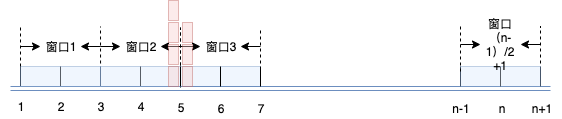
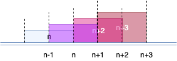

# 为什么要限流

## 恶意的流量访问

​	线上服务运行过程中，或多或少都会接收到恶意的流量访问，巨量的DDOS攻击可能会直接导致服务的崩溃，限流可以为后端服务提供一定程度的保护

## 服务处理能力有限

​	有时由于硬件资源、服务并发处理能力有限，后端服务必须对访问流量加以限制，以过滤掉超过自身处理能力的访问

## Open API服务

​	对于一些Open API服务，例如百度地图开放平台、腾讯AI开放平台都提供了基于QPS的计费策略，该计费策略下同样需要限流的处理
# 限流算法

## 固定窗口限流

​	固定窗口限流算法将所有请求划分到长度固定的时间窗口内，在每个窗口期中分别通过计数进行流量控制，窗口的切换将导致计数器的清零。如下图所示



所有请求被被划分到长度为2s的窗口中，窗口的切换会导致计数值的重置（1时刻计数值为0，3时刻计数值重置到0）。

​	固定窗口限流实现简单，但没有考虑窗口之间的流量访问，无法应对空窗期，如图所示假设在窗口2中有4次访问，窗口3中有3次流量访问，但在4-6时间段内实际访问流量为7，滑动窗口限流机制可以解决此问题。

​	固定窗口限流，原理简单，常用于一些OpenAPI的流控计费控制。

## 滑动窗口限流

​	滑动窗口限流将整个请求时间划分到一个不断滚动的窗口中（参见tcp的滑动窗口机制），每个窗口期内的计数会考虑其相邻窗口中的计数处理，如下图所示：



​	假设窗口持续时间为2，时间点n对应的窗口期实际为[n-2,n)（即时间点n的计数需要考虑[n-2,n)时间段内的访问量）,n+1点对应的窗口期实际为[n-1,n+1)（n+1内的计数需要考虑[n-1,n+1)时间段内的访问量）

## 漏桶限流

​	漏桶限流算法以"桶"对所有请求流量进行缓存，最终能够实现将请求以恒定速率放行，在漏桶限流中如果请求数目超过了最大请求限制，则应拒绝再提供服务，其处理如下图所示：


​	漏桶限流常用于访问流量的均衡处理，无法应对突发流量的控制。

## 令牌桶限流

​	令牌桶算法以固定的速率生成Token并存放在桶中（如果生成的token数目超过了桶的容量，则抛弃token，即桶中最多能够容纳的token数目是固定的），当请求到达时如果桶中有剩余token则对请求进行处理，如果桶中已经没有多余token则抛弃请求。其处理如下图所示：


# 限流方式

## 集中式限流

​	对于具有集中入口服务的系统、简单的单机服务，如API Gateway等，可以进行"单点"的限流。集中式限流器一般都是基于内存的处理。


## 分布式限流

​	对于一些多机部署的集群，可以采用分布式限流方式，如下所示：


分布式限流器一般采用redis+lua方式，利用了Lua脚本在redis中原子性。

# zlimiter

zlimiter是一个基于golang（1.12.7）的支持集中式、分布式限流方式，支持固定窗口、滑动窗口、bucket、token限流算法的限流器。

在工程中启用使用zlimiter：

`go get github.com/zzerroo/zlimiter`

分布式限流基于redis，所有测试都基于5.0.5版本。此外，分布式版本基于Lua脚本，目前暂不支持redis集群。


# zlimiter的使用

## 固定窗口限流

zlimiter支持集中式、分布式的固定窗口限流，创建相应限流器的代码如下：

创建集中式固定窗口限流器：

```go
memLimit := zlimiter.NewLimiter(zlimiter.LimitMemFixWindow)
```

创建分布式固定窗口限流器：

```go
redisLimit := zlimiter.NewLimiter(zlimiter.LimitRedisFixWindow, rds.RedisInfo{Address: "127.0.0.1:6379", Passwd: "test"})
```

## 滑动窗口限流

zlimiter中创建集中式、分布式滑动窗口限流代码如下：

创建集中式滑动窗口限流器：

```go
memLimit := zlimiter.NewLimiter(zlimiter.LimitMemSlideWindow)
```

创建分布式滑动窗口限流器：

```go
redisLimit := zlimiter.NewLimiter(zlimiter.LimitRedisSlideWindow, rds.RedisInfo{Address: "127.0.0.1:6379", Passwd: "test"})
```

## Bucket限流

zlimter中创建集中式、分布式bucket桶限流器的代码如下：

创建集中式bucket窗口限流器：

```go
memLimit := zlimiter.NewLimiter(zlimiter.LimitMemBucket)
```

创建分布式bucket限流器：

```
redisLimit := zlimiter.NewLimiter(zlimiter.LimitRedisBucket, rds.RedisInfo{Address: "127.0.0.1:6379", Passwd: "test"})
```

## Token限流

zlimiter中创建集中式、分布式token限流器代码如下：

创建集中式token限流器：

```go
memLimit := zlimiter.NewLimiter(zlimiter.LimitMemToken)
```

创建分布式token限流器：

```go
redisLimit := zlimiter.NewLimiter(zlimiter.LimitRedisToken, rds.RedisInfo{Address: "127.0.0.1:6379", Passwd: "test"})
```

# zlimiter支持的web框架

\- [beego](./example/beego/beego.go)

\- [echo](./example/echo/echo.go)

\- [gin](./example/gin/gin.go)

\- [http](./example/http/http.go)


# 其他

部分图片来源于：

https://www.infoq.cn/article/Qg2tX8fyw5Vt-f3HH673

