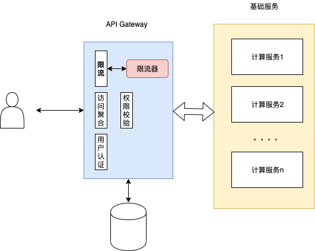
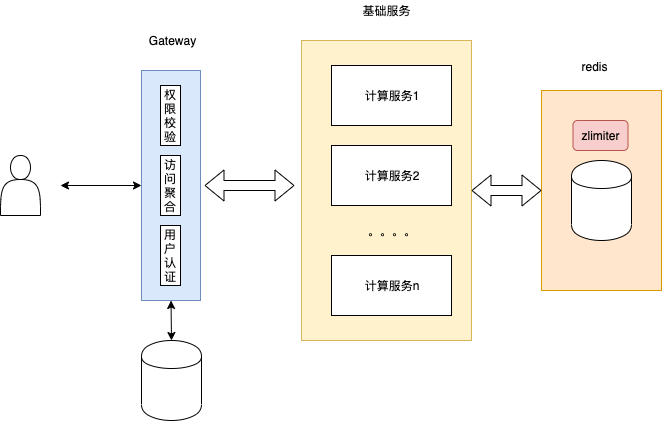

# 为什么要限流

## 恶意的流量访问

​	线上服务运行过程中，或多或少都会接收到恶意的流量访问，巨量的DDOS攻击可能会直接导致服务的崩溃，限流可以为后端服务提供一定程度的保护

## 服务处理能力有限

​	有时由于硬件资源、服务并发处理能力有限，后端服务必须对访问流量加以限制，以过滤掉超过自身处理能力的访问

## Open API服务

​	对于一些Open API服务，例如百度地图开放平台、腾讯AI开放平台都提供了基于QPS的计费策略，该计费策略下同样需要限流的处理

# zlimiter支持的限流方式

## 集中式限流

​	对于具有集中入口服务的系统、简单的单机服务，如API Gateway等，zlimiter提供了基于内存的限流处理。



## 分布式限流

​	对于一些多机部署的集群，zlimiter提供了基于redis lua的分布式处理方式，如下所示：



# zlimiter支持的限流算法

## 固定窗口限流

固定窗口限流指将所有请求划分到长度固定的时间窗口内，并在每个窗口中分别进行流量控制。zlimiter支持集中式、分布式的固定窗口限流，创建相应限流器的代码如下：

创建集中式固定窗口限流器：

```go
memLimit := zlimiter.NewLimiter(zlimiter.LimitMemFixWindow)
```

创建分布式固定窗口限流器：

```go
redisLimit := zlimiter.NewLimiter(zlimiter.LimitRedisFixWindow, rds.RedisInfo{Address: "127.0.0.1:6379", Passwd: "test"})
```

## 滑动窗口限流

滑动窗口限流解决了固定窗口中存在的相邻窗口流量异常的问题，以滑动的时间框表示时间窗口，每次限流都会考虑相邻时间窗口的流量。zlimiter中创建集中式、分布式滑动窗口限流代码如下：

创建集中式滑动窗口限流器：

```go
memLimit := zlimiter.NewLimiter(zlimiter.LimitMemSlideWindow)
```

创建分布式滑动窗口限流器：

```go
redisLimit := zlimiter.NewLimiter(zlimiter.LimitRedisSlideWindow, rds.RedisInfo{Address: "127.0.0.1:6379", Passwd: "test"})
```

## Bucket限流

Bucket限流模拟了水桶注水、滴水的过程，所有的请求都会以恒定速率放行，同时超过桶容量的请求将会被抛弃。zlimter中创建集中式、分布式bucket桶限流器的代码如下：

创建集中式bucket窗口限流器：

```go
memLimit := zlimiter.NewLimiter(zlimiter.LimitMemBucket)
```

创建分布式bucket限流器：

```
redisLimit := zlimiter.NewLimiter(zlimiter.LimitRedisBucket, rds.RedisInfo{Address: "127.0.0.1:6379", Passwd: "test"})
```

##Token限流

Token限流以恒定的速率产生token，所有放行的请求都能够得到一个token，当token数量超过了token桶的容量时，token会被抛弃。zlimiter中创建集中式、分布式token限流器代码如下：

创建集中式token限流器：

```go
memLimit := zlimiter.NewLimiter(zlimiter.LimitMemToken)
```

创建分布式token限流器：

```go
redisLimit := zlimiter.NewLimiter(zlimiter.LimitRedisToken, rds.RedisInfo{Address: "127.0.0.1:6379", Passwd: "test"})
```

# zlimiter支持的web框架

\- [beego](./example/beego/beego.go)

\- [echo](./example/echo/echo.go)

\- [gin](./example/gin/gin.go)

\- [http](./example/http/http.go)
